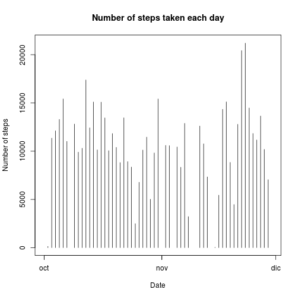

##Loading necesary libraries

```r
library(lubridate)
library(dplyr)
```
## Loading and preprocessing the data

```r
unzip("activity.zip","activity.csv")
activity<-read.csv("activity.csv")
```
Convert **date** to a more useful format  

```r
activity$date<-ymd(activity$date)
```
## What is mean total number of steps taken per day?
1. Firt sum steps taken per day

```r
totalStepsByDay <- select(activity, steps, date) %>%
        group_by(date) %>%
        summarise(totalSteps = sum(steps))
```
2. Histogram 

```r
plot(totalStepsByDay$date,totalStepsByDay$totalSteps,type="h",xlab="Date", ylab="Number of steps", main="Number of steps taken each day")
```

 

3. Calculate mean and median of steps per day

```r
meanSteps<-mean(totalStepsByDay$totalSteps,na.rm=TRUE)
medianSteps<-median(totalStepsByDay$totalSteps,na.rm=TRUE)
cat('Mean:',meanSteps,' Median:',medianSteps)
```

```
## Mean: 10766.19  Median: 10765
```

## What is the average daily activity pattern?
1. Summarize the number of steps taken grouped by intervals

```r
totalSteps<-sum(activity$steps,na.rm=TRUE)
totalSteps5min<-select(activity, steps,interval) %>%
        group_by(interval) %>%
        summarise(steps=mean(steps,na.rm=TRUE))
```
2. Plot 

```r
plot(totalSteps5min$interval,totalSteps5min$steps,type='l',xlab="Interval", ylab="Average steps",main="Average number of steps per Interval")
```

 

3. The interval with the higher number of steps was:

```r
activity[max(activity$steps,na.rm=TRUE),"interval"]
```

```
## [1] 1905
```
## Imputing missing values
1. Total number of rows with missing values in the dataset

```r
nrow(activity)-sum(complete.cases(activity))
```

```
## [1] 2304
```
2. Filling NA's with the median of the 5-min inteval. 

Calculate the mean for 5-minute intervals.

```r
meanSteps5min<-select(activity, steps,interval) %>%
        group_by(interval) %>%
        summarise(meanSteps=mean(steps,na.rm=TRUE))
```
3. Create a dataset with NA's filled

```r
activityFilled<-activity
NAindex<-which(is.na(activityFilled$steps))
for (f in NAindex){
        actualInterval<-activityFilled$interval[f]
        activityFilled$steps[f]=meanSteps5min$meanSteps[which(meanSteps5min$interval == actualInterval)]
}
```
4. What is mean total number of steps taken per day with NA's filled?  

Sum steps taken per day

```r
totalStepsByDayFilled <- select(activityFilled, steps, date) %>%
        group_by(date) %>%
        summarise(totalSteps = sum(steps))
```
Histogram with NA's filled

```r
plot(totalStepsByDayFilled$date,totalStepsByDayFilled$totalSteps,type="h",xlab="Date", ylab="Number of steps", main="Number of steps taken each day without NA's")
```

 

Calculate mean and median of steps per day

```r
meanStepsFilled<-mean(totalStepsByDayFilled$totalSteps,na.rm=TRUE)
medianStepsFilled<-median(totalStepsByDayFilled$totalSteps,na.rm=TRUE)
cat('Mean:',meanStepsFilled,' Median:',medianStepsFilled)
```

```
## Mean: 10766.19  Median: 10766.19
```


## Are there differences in activity patterns between weekdays and weekends?  
1. Create a factor column indicating if date is a weekend or not.  

```r
weekDay<-function(date){
        nday<-wday(date)
        #1=Sunday, 7=Saturday
        if((nday==1) | (nday==7)) {'weekend'}
        else {'weekday'}
}
activityFilled$weekday<-as.factor(mapply(weekDay,activityFilled$date))
```
2. Make a plot

```r
meanSteps5minWeekend<-select(activityFilled, steps,interval,weekday) %>%
        filter(weekday=='weekend') %>%
        group_by(interval) %>%
        summarise(meanSteps=mean(steps,na.rm=TRUE))
meanSteps5minWeekday<-select(activityFilled, steps,interval,weekday) %>%
        filter(weekday=='weekday') %>%
        group_by(interval) %>%
        summarise(meanSteps=mean(steps,na.rm=TRUE))
par(mfrow=c(2,1),mar=c(4,4,2,2),oma=c(2,0,2,0))
plot(meanSteps5minWeekday$interval,meanSteps5minWeekday$meanSteps,type="l",col="blue", main="Weekday",xlab="",ylab="Number of steps")
plot(meanSteps5minWeekend$interval,meanSteps5minWeekend$meanSteps,type="l",col="red",main="Weekend",xlab="Interval",ylab="Number of steps")
```

 
